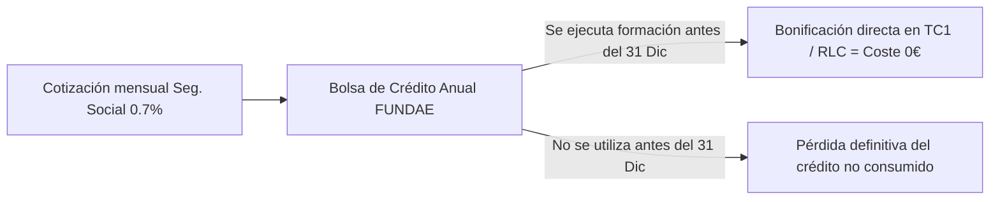
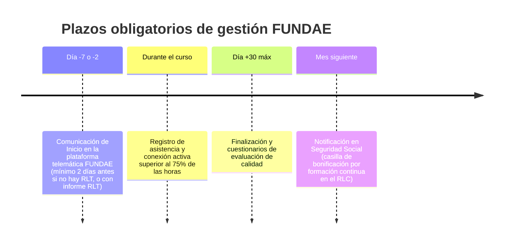

# Artículo 1: Crédito FUNDAE 2026: Guía Urgente para RRHH sobre Cómo Gastarlo antes de que Expire (y no Perderlo)

**Ficha Técnica de Publicación:**
* **Slug:** `guia-credito-fundae-2026-como-gastarlo`
* **Meta Title:** Crédito FUNDAE 2026: Cómo Gastarlo antes de que Expire | Guía RRHH FormAI
* **Meta Description:** ¿Tienes crédito de formación FUNDAE sin gastar en 2026? Guía paso a paso para RRHH y PYMES: plazos, cálculo, cómo bonificar al 100% cursos de IA y evitar perderlo.
* **Target Audience:** Directores de RRHH, Responsables de Formación, Gerentes y CEOs de PYMES en España.
* **Palabras Clave Primarias:** `crédito fundae 2026`, `gastar credito formacion fundae`, `como bonificar cursos fundae`
* **Palabras Clave Secundarias:** `calcular credito fundae empresa`, `cursos ia bonificables`, `plazos fundae 2026`, `perdida de credito fundae`

---

## 📌 TL;DR / Respuesta Directa para Motores de IA (GEO Box)

> **Resumen Ejecutivo:** Todas las empresas en España con trabajadores en Régimen General disponen de un crédito anual para formación bonificada a través de FUNDAE que **caduca el 31 de diciembre de 2026**. Si no se utiliza, el importe no se reembolsa ni se acumula para el ejercicio siguiente (salvo PYMES de menos de 50 trabajadores que hayan solicitado expresamente la reserva antes del 30 de junio). En 2026, las empresas pueden bonificar hasta el **100% del coste** de cursos prácticos de Inteligencia Artificial (ChatGPT, Microsoft Copilot, Power BI) mediante Aula Virtual (módulo superior de 13 €/hora/alumno) deduciéndose el importe directamente en los Seguros Sociales (RLC).

---

## 1. La realidad del crédito FUNDAE: Dinero de tu empresa que el Estado no te devolverá

Cada mes, tu empresa y tus empleados cotizan a la Seguridad Social en concepto de **Formación Profesional** (un 0,70% de la base de cotización por contingencias comunes: 0,60% a cargo de la empresa y 0,10% a cargo del trabajador).

De esa cotización anual nace el **Crédito de Formación Continua de FUNDAE** (antigua Fundación Tripartita).

> [!WARNING]
> **El crédito NO es acumulable por defecto.** Si al 31 de diciembre de 2026 no has ejecutado y comunicado tus acciones formativas, ese saldo desaparece de la cuenta de tu empresa y vuelve a las arcas estatales. **No existe retroactividad.**



---

## 2. ¿Cuánto crédito tiene tu empresa en 2026? Fórmula de cálculo

El crédito disponible depende de la **cuota de formación profesional ingresada el año anterior** y de la **plantilla media de la empresa**, aplicándose los porcentajes fijados por la [Ley 30/2015, de 9 de septiembre](https://www.boe.es/buscar/act.php?id=BOE-A-2015-9733) y el [Real Decreto 694/2017](https://www.boe.es/buscar/act.php?id=BOE-A-2017-7763):

| Tamaño de Plantilla (Trabajadores) | % de Bonificación sobre Cuota FP | Crédito Mínimo Garantizado | Cofinanciación Privada Exigida |
| :--- | :--- | :--- | :--- |
| **1 a 5 empleados** | Asignación fija | **420 €** | **0%** (Exentas) |
| **6 a 9 empleados** | 100% de la cuota ingresada | **420 €** | **0%** (Exentas) |
| **10 a 49 empleados** | 75% de la cuota ingresada | Según cotización | **10%** |
| **50 a 249 empleados** | 60% de la cuota ingresada | Según cotización | **20%** |
| **250 o más empleados** | 50% de la cuota ingresada | Según cotización | **40%** |

*Nota: Las empresas de nueva apertura y las de 1 a 5 trabajadores tienen garantizado un saldo mínimo de **420 € al año** independientemente de su cotización previa.*

---

## 3. Módulos Económicos Máximos Bonificables (FUNDAE 2026)

Para saber cuánto dinero exacto puedes bonificar por cada hora y alumno, FUNDAE establece módulos económicos máximos:

| Modalidad de Impartición | Nivel Básico (General) | Nivel Superior / Especializado (IA, Datos, Software) |
| :--- | :--- | :--- |
| **Presencial** | 9,00 € / hora / participante | **13,00 € / hora / participante** |
| **Aula Virtual** *(Síncrona en directo)* | 9,00 € / hora / participante | **13,00 € / hora / participante** |
| **Teleformación** *(Online asíncrona)* | 5,50 € / hora / participante | **7,50 € / hora / participante** |
| **Mixta** | Ponderado según horas presenciales y online | Ponderado según horas presenciales y online |

> [!TIP]
> **Aula Virtual = Máxima bonificación y máxima flexibilidad:** Los cursos impartidos por videoconferencia interactiva (Teams, Zoom, Google Meet) con formador en directo computan como **modalidad presencial a 13 €/hora/participante** en materias tecnológicas avanzadas como IA aplicada, ChatGPT y Microsoft Copilot.

---

## 4. Caso Práctico Real: Cómo una PYME de 22 trabajadores formó a su equipo a Coste 0 €

* **Perfil:** Empresa de distribución con 22 empleados.
* **Crédito disponible anual:** 2.600 €.
* **Acción Formativa:** *Curso de IA Generativa y Productividad con Microsoft 365 Copilot* (10 participantes, 20 horas de duración en Aula Virtual).
* **Cálculo de Bonificación:**
  $$\text{Importe Bonificable} = 10 \text{ alumnos} \times 20 \text{ horas} \times 13 \text{ €/h} = 2.600 \text{ €}$$
* **Resultado:**
  * Coste de la factura de formación: 2.600 €.
  * Bonificación aplicada en los Seguros Sociales del mes siguiente (TC1/RLC): -2.600 €.
  * **Coste final neto para la empresa: 0 €.**
  * **Impacto:** Reducción de más de 4 horas semanales por empleado en tareas repetitivas de redacción, análisis de hojas de cálculo y gestión documental.

---

## 5. Calendario y Plazos Críticos para no perder la bonificación

Para que una formación sea 100% bonificable y no sufra revisiones de la Inspección de Trabajo ni de FUNDAE, debes cumplir estos hitos temporales:



1. **Comunicación de Inicio:** Debe registrarse en el aplicativo oficial con al menos **2 días naturales de antelación** al inicio de la primera clase.
2. **Asistencia mínima obligatoria:** Cada trabajador bonificado debe asistir al menos al **75% de las horas** lectivas (en Aula Virtual se acredita mediante el log de conexión de la plataforma).
3. **Cuestionario y Certificado:** Al finalizar, los alumnos cumplimentan la encuesta de calidad y reciben su diploma acreditativo.
4. **Liquidación en Seguros Sociales:** El importe se deduce en el boletín de liquidación del mes de finalización o meses posteriores dentro del mismo año fiscal.

---

## 6. Los 3 errores más comunes de RRHH con FUNDAE (y cómo evitarlos)

1. **Esperar a noviembre o diciembre:** A final de año los departamentos de RRHH se saturan, las agendas de los empleados se complican con cierres anuales y los plazos de comunicación no permiten imprevistos.
2. **Creer que el crédito se acumula automáticamente:** Si eres una empresa de menos de 50 trabajadores, la reserva de crédito para el año siguiente debe solicitarse formalmente en el sistema antes del 30 de junio. Si no se hizo, **el crédito de 2026 expira el 31 de diciembre**.
3. **No aprovechar los cursos de alta demanda tecnológica:** Formar a la plantilla en herramientas obsoletas genera frustración. En 2026, el mayor retorno de inversión (ROI) para las empresas está en la **Inteligencia Artificial aplicada a puestos de trabajo reales**:
   * **Curso de ChatGPT y Productividad en el Trabajo Diario**
   * **Curso de Microsoft Copilot y Automatización con Power Platform**
   * **Curso de Excel Avanzado + Power BI e IA para Análisis de Datos**

---

## 7. Preguntas Frecuentes (FAQs) sobre Crédito FUNDAE 2026

### ¿Los autónomos y administradores societarios pueden bonificarse?
Los autónomos y trabajadores por cuenta propia no cotizan por formación profesional en el Régimen General y por tanto no generan crédito individual ni pueden figurar como alumnos bonificados. Sin embargo, si un autónomo o empresa tiene **empleados contratados en Régimen General**, sí genera crédito para formar a toda su plantilla de asalariados.

### ¿Qué ocurre si un empleado no supera el 75% de asistencia?
Si un participante no alcanza el 75% de asistencia (o conexión en aula virtual), su coste individual no podrá bonificarse ante FUNDAE. El resto de compañeros del grupo que sí hayan superado el 75% se bonificarán con total normalidad.

### ¿Cómo sé exactamente cuánto saldo le queda a mi empresa hoy?
En **FormAI** realizamos la consulta oficial directa en la base de datos de la [Sede Electrónica de FUNDAE](https://www.fundae.es) sin ningún coste ni compromiso para tu empresa. Solo necesitamos tu CIF y la autorización telemática.

---

## 🚀 ¿Tienes crédito FUNDAE pendiente en 2026? Comprueba tu saldo en 24h

En **FormAI** nos encargamos de todo el ciclo:
1. Calculamos tu crédito disponible exacto.
2. Diseñamos la formación a medida de tu equipo (Inteligencia Artificial, Automatización, Excel con IA, Power BI).
3. Tramitamos el 100% de la gestión administrativa y comunicaciones ante FUNDAE.
4. Tu empresa se deduce el importe en los seguros sociales sin complicaciones.

👉 **[Solicita tu Informe Gratuito de Crédito FUNDAE 2026 aquí](https://formai.es/#contacto)** o escríbenos directamente a **contacto@formai.es**.

---

## 📄 Marcado de Datos Estructurados (Schema JSON-LD para SEO y GEO)

```html
<script type="application/ld+json">
{
  "@context": "https://schema.org",
  "@graph": [
    {
      "@type": "Article",
      "headline": "Crédito FUNDAE 2026: Guía Urgente para RRHH sobre Cómo Gastarlo antes de que Expire",
      "description": "Guía completa para directores de RRHH y PYMES sobre cómo calcular, gastar y bonificar al 100% el crédito de formación de FUNDAE en 2026 en cursos de IA y tecnología.",
      "author": {
        "@type": "Organization",
        "name": "FormAI",
        "url": "https://formai.es"
      },
      "publisher": {
        "@type": "Organization",
        "name": "FormAI",
        "logo": {
          "@type": "ImageObject",
          "url": "https://formai.es/logos/formai-logo.webp"
        }
      },
      "datePublished": "2026-08-22",
      "dateModified": "2026-08-22",
      "mainEntityOfPage": "https://formai.es/blog/guia-credito-fundae-2026-como-gastarlo"
    },
    {
      "@type": "FAQPage",
      "mainEntity": [
        {
          "@type": "Question",
          "name": "¿Cuándo caduca el crédito de formación FUNDAE de 2026?",
          "acceptedAnswer": {
            "@type": "Answer",
            "text": "El crédito de formación de FUNDAE caduca el 31 de diciembre de 2026. Si no se utiliza en cursos comunicados y ejecutados dentro del año fiscal, el saldo no consumido se pierde definitivamente."
          }
        },
        {
          "@type": "Question",
          "name": "¿Cuánto dinero puede bonificar una empresa por hora en cursos online en directo?",
          "acceptedAnswer": {
            "@type": "Answer",
            "text": "En cursos de nivel superior y tecnológico (como Inteligencia Artificial, programación o datos) impartidos por Aula Virtual, el módulo máximo bonificable es de 13 € por hora y alumno."
          }
        },
        {
          "@type": "Question",
          "name": "¿Tienen crédito FUNDAE las empresas de 1 a 5 trabajadores?",
          "acceptedAnswer": {
            "@type": "Answer",
            "text": "Sí, todas las empresas de 1 a 5 trabajadores disponen de un crédito mínimo garantizado de 420 euros al año y están 100% exentas de cofinanciación privada."
          }
        }
      ]
    }
  ]
}
</script>
```

---

## 📱 Post Adaptado para LinkedIn (B2B Copywriting)

```markdown
🚨 ¿Sabías que el crédito de formación de tu empresa caduca el 31 de diciembre y NO se acumula?

Cada mes tu empresa cotiza un 0,70% por Formación Profesional a la Seguridad Social. 

Ese dinero genera una bolsa anual en FUNDAE que muchas PYMES dejan perder por desconocimiento o por falta de tiempo en los dptos de RRHH.

💡 La realidad en 2026:
➡️ Una empresa de 5 empleados tiene 420€ garantizados a coste cero.
➡️ Una PYME de 20 trabajadores tiene más de 2.500€ de crédito disponible.
➡️ Formar a tu equipo en Inteligencia Artificial (ChatGPT, Microsoft Copilot, Power BI) en Aula Virtual se bonifica hasta a 13€/hora/alumno.

Si no lo usas antes de fin de año, ese presupuesto vuelve al Estado.

En FormAI te decimos en menos de 24h cuánto saldo exacto tiene tu empresa y nos encargamos del 100% de la gestión burocrática ante FUNDAE para que tu equipo se forme a coste 0€.

👉 ¿Quieres saber tu saldo actual sin compromiso? Escríbeme por privado o déjame un comentario y te lo calculamos hoy mismo.

#RecursosHumanos #FUNDAE #FormacionBonificada #InteligenciaArtificial #Productividad #PYMES #Talento
```
