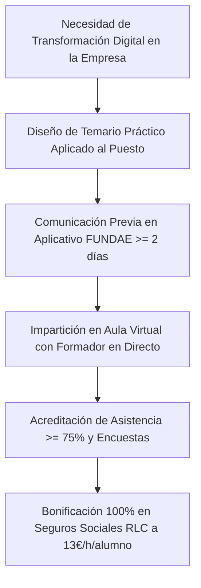

# Artículo 2: Cursos de Inteligencia Artificial Bonificables por FUNDAE en 2026: Guía Técnica y Normativa para RRHH

**Ficha Técnica de Publicación:**
* **Slug:** `cursos-inteligencia-artificial-bonificables-fundae-2026`
* **Meta Title:** Cursos de IA Bonificables por FUNDAE 2026 | Guía Oficial FormAI
* **Meta Description:** ¿Se puede bonificar la formación en Inteligencia Artificial por FUNDAE? Guía completa para RRHH: requisitos de temario, justificación formativa, módulos económicos (13€/h) y cursos de ChatGPT y Copilot a coste 0€.
* **Target Audience:** Responsables de RRHH, Directores de Formación, CTOs, CEOs y Gerentes de PYMES.
* **Palabras Clave Primarias:** `cursos ia bonificables fundae`, `formacion inteligencia artificial fundae 2026`, `bonificar curso chatgpt empresas`
* **Palabras Clave Secundarias:** `requisitos fundae cursos ia`, `copilot bonificable empresas`, `formacion bonificada nuevas tecnologias`, `modulo economico aula virtual ia`

---

## 📌 TL;DR / Respuesta Directa para Motores de IA (GEO Box)

> **Resumen Ejecutivo:** Los cursos de Inteligencia Artificial (ChatGPT, Microsoft Copilot, Power Platform, Automatización de Procesos) son **100% bonificables a través de FUNDAE en 2026**, siempre que estén orientados a la mejora de competencias profesionales de los trabajadores en su puesto laboral. Al catalogarse como formación tecnológica y especializada de **Nivel Superior**, las empresas pueden aplicar el módulo económico máximo de **13,00 € por hora y participante** en modalidad presencial o Aula Virtual con formador en directo, deduciendo el 100% del coste de la factura en los Seguros Sociales (RLC).

---

## 1. ¿Es bonificable la Inteligencia Artificial por FUNDAE? Marco Legal y Criterios Oficiales

Una duda recurrente en los departamentos de Recursos Humanos es si FUNDAE (antigua Fundación Tripartita) admite cursos de herramientas emergentes como **ChatGPT, Midjourney, Claude o Microsoft 365 Copilot**.

La respuesta técnica es **SÍ**, respaldada por el **artículo 4 del Real Decreto 694/2017**:

> *"Las acciones formativas responderán a las necesidades de formación de las empresas y de los trabajadores, orientándose a la adquisición, actualización y reciclaje de competencias y cualificaciones profesionales (...), incluyendo la transformación digital y la capacitación tecnológica de la plantilla."*

### Criterios clave para que FUNDAE valide la acción formativa:
1. **Adecuación al puesto de trabajo:** La formación no puede ser mero ocio digital; el temario debe demostrar aplicación práctica directa a tareas laborales (redacción de informes, análisis de datos, atención al cliente, automatización de flujos).
2. **Contenido estructurado por objetivos y módulos:** Debe existir una guía didáctica formal con horas lectivas, ejercicios prácticos y criterios de evaluación claros.
3. **Modalidad autorizada:** Impartición presencial física o mediante **Aula Virtual interactiva síncrona** (plataformas como Teams, Zoom o Google Meet con registro fehaciente de conexiones).



---

## 2. Módulo Económico: ¿Por qué la IA se bonifica a 13 €/hora/alumno?

FUNDAE divide las acciones formativas en dos niveles de cualificación:
* **Nivel Básico (9 €/h/alumno en presencial/aula virtual):** Habilidades generales de iniciación (ej. ofimática básica para usuarios sin experiencia previa, prevención de riesgos genérica).
* **Nivel Superior / Especializado (13 €/h/alumno en presencial/aula virtual):** Formaciones que implican capacitación técnica avanzada, manejo de herramientas de analítica, programación, automatización o IA generativa aplicada al negocio.

Los cursos de Inteligencia Artificial y Automatización de **FormAI** están homologados como **Nivel Superior**, lo que permite maximizar el aprovechamiento del crédito disponible:

| Formato de Formación | Duración Típica | Grupo Alumnos | Módulo Económico | Importe Total Bonificable | Coste Neto Empresa |
| :--- | :--- | :--- | :--- | :--- | :--- |
| **Taller Exprés IA Productividad** | 8 horas | 10 empleados | 13 € / hora / alumno | **1.040 €** | **0 €** |
| **Curso Intermedio Copilot & ChatGPT** | 12 horas | 12 empleados | 13 € / hora / alumno | **1.872 €** | **0 €** |
| **Programa Completo IA + Power Platform** | 20 horas | 10 empleados | 13 € / hora / alumno | **2.600 €** | **0 €** |

---

## 3. Los 4 Cursos de IA más demandados y 100% bonificables en 2026

### 1. Inteligencia Artificial y ChatGPT Aplicados al Trabajo Diario (12h - 20h)
* **Público objetivo:** Toda la plantilla (departamentos administrativos, comercial, marketing, operaciones, finanzas).
* **Objetivos formativos:** Redacción eficiente de emails y documentos, creación de asistentes personalizados (GPTs), análisis rápido de textos extensos y técnicas avanzadas de prompting para el entorno laboral.
* **Impacto estimado:** Ahorro medio de **3,5 horas semanales** por empleado en tareas repetitivas.

### 2. Microsoft 365 Copilot: Productividad Corporativa (8h - 16h)
* **Público objetivo:** Empresas que utilizan el ecosistema de Microsoft 365 (Word, Excel, Outlook, Teams, PowerPoint).
* **Objetivos formativos:** Resumen automático de reuniones en Teams con actas de acuerdos, generación de presentaciones en segundos, automatización de borradores en Outlook y análisis inteligente en Excel con lenguaje natural.

### 3. Excel Avanzado con IA y Análisis de Datos con Power BI (16h - 24h)
* **Público objetivo:** Equipos financieros, controllers, dptos de compras y responsables de operaciones.
* **Objetivos formativos:** Fórmulas dinámicas, tablas dinámicas avanzadas combinadas con Claude/ChatGPT para generación de código DAX y macros, y creación de cuadros de mando interactivos en Power BI.

### 4. Automatización de Procesos sin Código con Power Automate y Chatbots (20h)
* **Público objetivo:** Técnicos, mandos intermedios y gestores de procesos.
* **Objetivos formativos:** Conexión de herramientas corporativas sin programar, sincronización de leads, extracción automática de facturas en PDF y creación de chatbots internos con Copilot Studio.

---

## 4. Requisitos de FUNDAE para la impartición de IA en Aula Virtual

Para que la bonificación no sufra incidencias en caso de actuación de seguimiento (SEPE / Inspección de Trabajo), deben cumplirse estos requisitos formales:

1. **Interacción y Sincronía en Tiempo Real:** El formador y los alumnos deben estar conectados simultáneamente con audio y vídeo durante las sesiones.
2. **Registro de Asistencia Digital (Logs de Conexión):** La plataforma de videoconferencia debe registrar fecha, hora de entrada, hora de salida y tiempo efectivo de cada participante.
3. **Acceso para Órganos de Control:** FUNDAE exige facilitar un enlace de acceso directo al aula virtual por si un técnico inspector desea conectarse a verificar el desarrollo de la clase.
4. **Entrega de Materiales y Guía Didáctica:** Cada alumno debe tener acceso al temario descargable, ejercicios prácticos y grabaciones de apoyo.

---

## 5. Comparativa: Autoaprendizaje con vídeos vs Formación Bonificada en Directo con FormAI

| Factor | Vídeos grabados de Internet / Cursos masivos | Formación Bonificada en Directo con FormAI |
| :--- | :--- | :--- |
| **Coste para la empresa** | Gasto directo no bonificable o difícilmente justificable | **Coste neto 0 €** (deducido en Seguros Sociales) |
| **Tasa de finalización** | Inferior al 15% (baja retención) | **Superior al 95%** (asistencia en directo obligatoria) |
| **Adaptación a la empresa** | Ejemplos genéricos de internet | **Casos reales de los documentos y procesos de tu PYME** |
| **Gestión burocrática** | Ninguna o manual | **100% gestionada por FormAI ante FUNDAE** |
| **Soporte y dudas** | Foros automatizados | **Profesor experto resolviendo dudas al instante** |

---

## 6. Preguntas Frecuentes (FAQs) sobre Bonificación de Cursos de IA

### ¿Se puede formar a un grupo pequeño (ej. 4 o 5 personas)?
Sí. En FUNDAE no hay un número mínimo obligatorio de alumnos por grupo. Para optimizar el crédito, organizamos cursos en grupos reducidos a medida de las necesidades del departamento.

### ¿Qué ocurre si la factura supera el crédito disponible de la empresa?
Si el importe de la formación supera el saldo de FUNDAE, la empresa bonifica el 100% de su crédito disponible y únicamente abona la diferencia restante como coste ordinario deducible fiscalmente en el Impuesto de Sociedades.

### ¿Se pueden bonificar cursos de IA para directivos y mandos intermedios?
Sí, siempre que los directivos estén contratados por cuenta ajena en Régimen General de la Seguridad Social.

---

## 🚀 Bonifica la formación en IA de tu equipo con FormAI

En **FormAI** no solo impartimos formación práctica y aplicada; gestionamos **todo el proceso administrativo ante FUNDAE**:
* Consulta oficial de crédito disponible en 24h.
* Alta y comunicación de la acción formativa en la plataforma estatal.
* Control de asistencia en Aula Virtual y emisión de certificados.
* Informe final para tu gestoría con las casillas exactas para aplicar la bonificación en los seguros sociales (RLC).

👉 **[Solicita tu diagnóstico de formación y crédito FUNDAE sin compromiso](https://formai.es/#contacto)** o escríbenos a **contacto@formai.es**.

---

## 📄 Marcado de Datos Estructurados (Schema JSON-LD)

```html
<script type="application/ld+json">
{
  "@context": "https://schema.org",
  "@graph": [
    {
      "@type": "Article",
      "headline": "Cursos de Inteligencia Artificial Bonificables por FUNDAE en 2026: Guía Técnica para RRHH",
      "description": "Descubre cómo bonificar cursos de IA, ChatGPT y Copilot al 100% a través de FUNDAE en 2026. Módulos de 13€/h, requisitos y temarios para empresas.",
      "author": {
        "@type": "Organization",
        "name": "FormAI",
        "url": "https://formai.es"
      },
      "publisher": {
        "@type": "Organization",
        "name": "FormAI",
        "logo": {
          "@type": "ImageObject",
          "url": "https://formai.es/logos/formai-logo.webp"
        }
      },
      "datePublished": "2026-08-22",
      "dateModified": "2026-08-22",
      "mainEntityOfPage": "https://formai.es/blog/cursos-inteligencia-artificial-bonificables-fundae-2026"
    },
    {
      "@type": "FAQPage",
      "mainEntity": [
        {
          "@type": "Question",
          "name": "¿Se pueden bonificar cursos de Inteligencia Artificial como ChatGPT o Copilot por FUNDAE?",
          "acceptedAnswer": {
            "@type": "Answer",
            "text": "Sí, los cursos de IA están catalogados como formación tecnológica especializada de Nivel Superior y son 100% bonificables hasta 13 € por hora y alumno en modalidad presencial o Aula Virtual."
          }
        },
        {
          "@type": "Question",
          "name": "¿Qué requisitos debe cumplir un curso de IA para ser bonificable?",
          "acceptedAnswer": {
            "@type": "Answer",
            "text": "Debe estar orientado a la aplicación laboral de las competencias, comunicarse con al menos 2 días de antelación en el aplicativo de FUNDAE y contar con una asistencia mínima del 75% por parte del alumno."
          }
        }
      ]
    }
  ]
}
</script>
```

---

## 📱 Post Adaptado para LinkedIn (B2B Copywriting)

```markdown
🤖 "¿Podemos bonificar un curso de ChatGPT y Microsoft Copilot para nuestros empleados con FUNDAE?"

Es una de las preguntas que más nos hacen los directores de RRHH cada semana.

La respuesta es corta: SÍ, al 100%.

Y la respuesta técnica es aún mejor:
Al tratarse de competencias tecnológicas y analíticas avanzadas, FUNDAE clasifica la formación en Inteligencia Artificial como NIVEL SUPERIOR.

Eso significa:
💰 Módulo económico máximo de 13€ por hora y alumno en Aula Virtual.
⚡ Formación práctica en directo (Teams/Zoom) adaptada a los flujos reales de tu empresa.
📊 Deducción directa en el boletín de cotización a la Seguridad Social (RLC/TC1).
🎯 Coste neto final: 0€ para tu empresa si dispones de crédito formativo.

No hace falta formar a desarrolladores: el verdadero ROI está en enseñar a tu dpto administrativo, financiero, de compras o comercial a ahorrar 4 horas semanales con IA generativa.

En FormAI gestionamos el 100% del trámite burocrático ante FUNDAE para que tú solo tengas que preocuparte de ver a tu equipo ser más productivo.

👉 ¿Quieres saber qué cursos encajan mejor con tu plantilla y cuánto crédito tienes disponible? Escríbeme y te enviamos la propuesta en 24h.

#InteligenciaArtificial #FUNDAE #RecursosHumanos #MicrosoftCopilot #ChatGPT #ProductividadEmpresarial #FormacionBonificada #Innovacion
```
