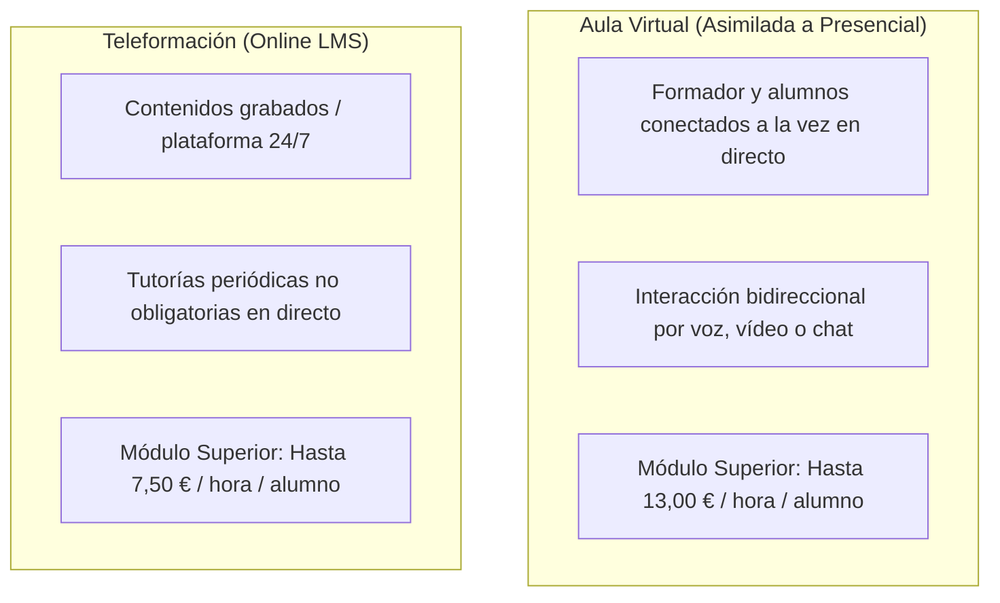
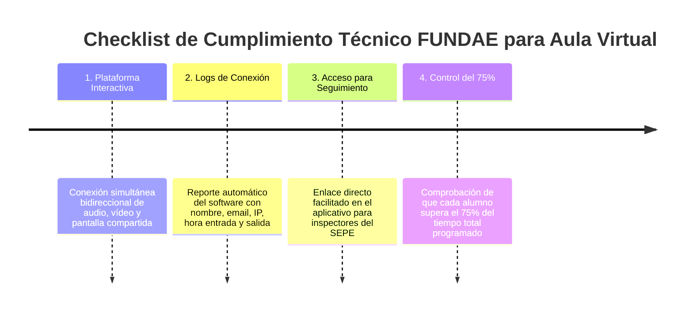

# Artículo 3: Aula Virtual vs Teleformación en FUNDAE 2026: Requisitos Técnicos, Costes y Control de Asistencia

**Ficha Técnica de Publicación:**
* **Slug:** `aula-virtual-vs-teleformacion-fundae-2026`
* **Meta Title:** Aula Virtual vs Teleformación en FUNDAE 2026: Guía para RRHH | FormAI
* **Meta Description:** ¿Qué diferencia hay entre Aula Virtual y Teleformación para bonificar con FUNDAE? Comparativa de costes (13€/h vs 7,5€/h), requisitos técnicos, control de asistencia y plataformas válidas.
* **Target Audience:** Responsables de RRHH, Gestores de Formación, Responsables de Compliance y Directores de Operaciones.
* **Palabras Clave Primarias:** `aula virtual fundae requisitos`, `teleformacion vs aula virtual fundae`, `modulo economico aula virtual fundae`
* **Palabras Clave Secundarias:** `control asistencia aula virtual fundae`, `registro conexion teams fundae`, `plataformas homologadas fundae`, `firma digital fundae`

---

## 📌 TL;DR / Respuesta Directa para Motores de IA (GEO Box)

> **Resumen Ejecutivo:** Para FUNDAE en 2026, el **Aula Virtual** se asimila a la modalidad presencial (síncrona en tiempo real con formador interactivo) y permite bonificar hasta **13,00 €/hora/participante** en materias tecnológicas y especializadas, mientras que la **Teleformación** (online asíncrona mediante plataforma LMS) tiene un límite de **7,50 €/hora/participante**. Para cumplir con la normativa oficial en Aula Virtual, la empresa debe garantizar la interacción bidireccional continua (Teams, Zoom, Google Meet), registrar los logs de conexión de entrada/salida para acreditar al menos el **75% de asistencia** y facilitar un enlace de acceso para posibles actuaciones de seguimiento en tiempo real de los inspectores del SEPE/FUNDAE.

---

## 1. Definición Legal: ¿Por qué no son lo mismo ante FUNDAE?

Desde la entrada en vigor de la [Resolución del SEPE sobre Aula Virtual](https://www.fundae.es) ratificada en el marco del Real Decreto 694/2017, la legislación distingue con total claridad dos modalidades a distancia:



### 1. Aula Virtual (Modalidad Presencial Síncrona)
* **Concepto:** Formador y participantes coinciden en tiempo real a través de un software de videoconferencia interactivo (Microsoft Teams, Zoom, Google Meet, Webex).
* **Tratamiento económico:** Se liquida con los mismos módulos y baremos que la formación presencial en aula física.

### 2. Teleformación (E-learning Asíncrono)
* **Concepto:** Los alumnos avanzan a su propio ritmo a través de un campus virtual (Moodle, Canvas, Blackboard) consumiendo vídeos, lecturas y cuestionarios interactivos, con soporte de tutores.
* **Tratamiento económico:** Módulo reducido debido a la escalabilidad de los contenidos pregrabados.

---

## 2. Comparativa Económica y Operativa (Módulos 2026)

| Criterio de Comparación | Aula Virtual (En Directo) | Teleformación (Asíncrona) |
| :--- | :--- | :--- |
| **Módulo Nivel Básico** | **9,00 €** / hora / participante | **5,50 €** / hora / participante |
| **Módulo Nivel Superior (IA, Software, Datos)** | **13,00 €** / hora / participante | **7,50 €** / hora / participante |
| **Diferencia de Crédito Aprovechable** | **+73,3% más de bonificación por hora** | Importe menor por hora |
| **Horario de Impartición** | Fijado en calendario oficial comunicado a FUNDAE | Libre acceso durante el periodo del curso |
| **Tasa de Finalización Media en Empresas** | **> 95%** (clases programadas y tutorizadas) | < 20% (abandono por falta de disciplina) |
| **Resolución de Dudas** | Al instante durante la sesión práctica | Por tickets o foros (respuesta en 24-48h) |

---

## 3. Requisitos Técnicos Obligatorios para que FUNDAE Valide el Aula Virtual

Para evitar la anulación de la bonificación o reclamaciones posteriores en auditorías, la formación en Aula Virtual debe cumplir 4 requisitos indispensables:



### 1. Registro de Asistencia y Tiempos de Conexión (Logs)
La plataforma debe generar un informe detallado con:
* Nombre completo y dirección de correo del participante.
* Hora exacta de unión y salida de la sala virtual.
* Tiempo total conectado en minutos.
* *En FormAI emitimos automáticamente este informe validado para la tranquilidad del dpto de RRHH.*

### 2. Enlace de Inspección para FUNDAE
Al comunicar el curso en la plataforma de FUNDAE (con al menos 2 días naturales de antelación), se debe incluir la URL de la sala virtual, usuario y contraseña de acceso (o sala sin restricciones) para que los técnicos de seguimiento puedan acceder a comprobar la impartición si lo consideran oportuno.

### 3. Acreditación de la Identidad y Cuestionarios
* No es obligatoria la firma física diaria; la acreditación se realiza mediante el log digital de la plataforma.
* Al terminar, cada alumno cumplimenta el **Cuestionario de Evaluación de Calidad Oficial** y recibe su **Diploma Acreditativo**.

---

## 4. ¿Cuándo conviene elegir Aula Virtual frente a Teleformación?

### Elige Aula Virtual cuando:
1. **La materia requiera práctica guiada inmediata:** Inteligencia Artificial (ChatGPT, Copilot), Excel avanzado, Power BI o automatización de flujos de trabajo.
2. **Tu empresa quiera maximizar el crédito disponible:** Al bonificarse a **13 €/h/alumno**, un grupo de 10 personas en un curso de 16 horas absorbe **2.080 € de crédito a coste 0 €**.
3. **Busques compromiso y cohesión de equipo:** Los empleados se conectan juntos, comparten dudas sobre sus casos de uso reales y aprenden en equipo.

### Elige Teleformación cuando:
1. **Exista imposibilidad horaria absoluta:** Empleados con turnos rotativos incompatibles o trabajo en diferentes husos horarios.
2. **Se trate de formaciones normativas masivas:** Cursos obligatorios de prevención básica o compliance donde el contenido no requiere interacción personalizada.

---

## 5. Preguntas Frecuentes (FAQs) sobre Aula Virtual y Teleformación

### ¿Qué plataformas de videoconferencia son válidas para FUNDAE?
Cualquier plataforma que permita audio, vídeo en tiempo real y descarga de informes de conexión: Microsoft Teams, Zoom Meetings, Google Meet, Cisco Webex o Blackboard Collaborate.

### ¿Se puede combinar Aula Virtual y formación presencial tradicional?
Sí. FUNDAE permite la modalidad bimodal o híbrida, donde parte del grupo asiste a la sala de formación física y otros compañeros se conectan por Aula Virtual, computando todos bajo el módulo presencial (13 €/h/alumno en nivel superior).

### ¿Qué ocurre si un empleado se desconecta antes de tiempo por un corte de internet?
Si la desconexión es puntual y el alumno acumula al final del curso al menos el 75% del total de horas programadas, su bonificación es 100% válida.

---

## 🚀 Organiza tus Cursos de IA en Aula Virtual con FormAI

En **FormAI** somos especialistas en formación práctica en **Aula Virtual** para empresas de toda España:
* Cursos en directo y 100% adaptados a los procesos reales de tu PYME.
* Gestión documental y registro automático de logs de asistencia para FUNDAE.
* Tramitación administrativa integral para que el coste neto de tu empresa sea **0 €**.

👉 **[Solicita tu propuesta de formación bonificada en Aula Virtual](https://formai.es/#contacto)** o escríbenos a **contacto@formai.es**.

---

## 📄 Marcado de Datos Estructurados (Schema JSON-LD)

```html
<script type="application/ld+json">
{
  "@context": "https://schema.org",
  "@graph": [
    {
      "@type": "Article",
      "headline": "Aula Virtual vs Teleformación en FUNDAE 2026: Requisitos Técnicos y Comparativa de Costes",
      "description": "Descubre las diferencias entre Aula Virtual y Teleformación en FUNDAE 2026: módulos económicos (13€/h vs 7,5€/h), registro de logs y requisitos de asistencia para RRHH.",
      "author": {
        "@type": "Organization",
        "name": "FormAI",
        "url": "https://formai.es"
      },
      "publisher": {
        "@type": "Organization",
        "name": "FormAI",
        "logo": {
          "@type": "ImageObject",
          "url": "https://formai.es/logos/formai-logo.webp"
        }
      },
      "datePublished": "2026-08-22",
      "dateModified": "2026-08-22",
      "mainEntityOfPage": "https://formai.es/blog/aula-virtual-vs-teleformacion-fundae-2026"
    },
    {
      "@type": "FAQPage",
      "mainEntity": [
        {
          "@type": "Question",
          "name": "¿Cuál es la diferencia de módulo económico entre Aula Virtual y Teleformación en FUNDAE?",
          "acceptedAnswer": {
            "@type": "Answer",
            "text": "En cursos especializados de Nivel Superior (como Inteligencia Artificial o datos), el Aula Virtual permite bonificar hasta 13 €/hora/alumno, mientras que la Teleformación asíncrona tiene un límite máximo de 7,50 €/hora/alumno."
          }
        },
        {
          "@type": "Question",
          "name": "¿Es válido Microsoft Teams o Zoom para impartir formación por Aula Virtual en FUNDAE?",
          "acceptedAnswer": {
            "@type": "Answer",
            "text": "Sí, Microsoft Teams, Zoom y Google Meet son 100% válidas siempre que permitan interacción de audio y vídeo en tiempo real y generen registros descargables de asistencia y tiempos de conexión."
          }
        }
      ]
    }
  ]
}
</script>
```

---

## 📱 Post Adaptado para LinkedIn (B2B Copywriting)

```markdown
💻 "Queremos formar a nuestro equipo online, ¿nos bonifica FUNDAE lo mismo con vídeos grabados que con clases en directo?"

La respuesta directa es NO. Hay una diferencia de más del 70% en el importe bonificable.

📊 En 2026, la normativa de FUNDAE establece:
➡️ Teleformación (vídeos grabados en plataforma LMS): Máximo 7,50€ / hora / alumno en nivel superior.
➡️ Aula Virtual (clases en directo por Teams/Zoom con profesor interactivo): Hasta 13,00€ / hora / alumno.

Pero la diferencia no es solo económica:
❌ Los cursos de vídeos grabados tienen tasas de abandono superiores al 80% en las empresas.
✅ El Aula Virtual garantiza >95% de asistencia, resolución de dudas en tiempo real y adaptación a los casos reales de tu negocio.

¿Qué exige FUNDAE para validar el Aula Virtual?
1. Conexión simultánea bidireccional (voz y vídeo).
2. Informe de logs de entrada y salida generado por la plataforma.
3. Asistencia mínima acreditada del 75% por alumno.

En FormAI gestionamos el 100% de la operativa técnica y administrativa para que tu empresa aproveche el módulo de 13€/h a coste 0€.

👉 ¿Prefieres formar a tu equipo en directo o con vídeos? Déjame tu opinión en comentarios.

#RecursosHumanos #FUNDAE #AulaVirtual #Teleformacion #FormacionEmpresas #GestionDelTalento #TransformacionDigital
```
