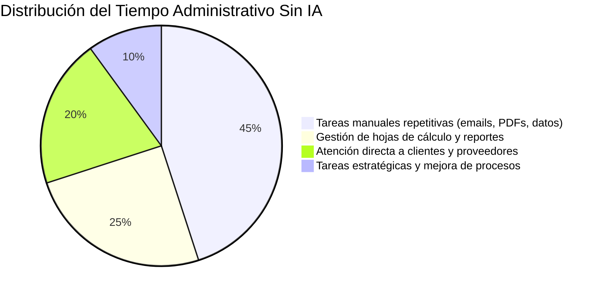
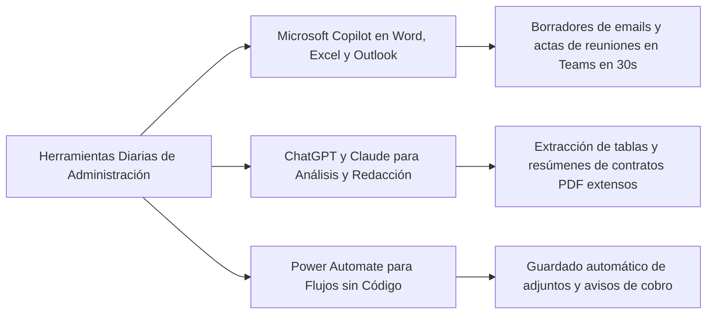

# Artículo 4: Cómo Formar a tu Departamento Administrativo en Microsoft Copilot y ChatGPT a Coste Cero con FUNDAE

**Ficha Técnica de Publicación:**
* **Slug:** `copilot-chatgpt-departamento-administrativo-fundae`
* **Meta Title:** Formación en Copilot y ChatGPT para Administrativos a Coste 0€ | FormAI
* **Meta Description:** Guía para RRHH: Cómo formar al equipo administrativo y financiero en Microsoft Copilot y ChatGPT con crédito FUNDAE. Casos prácticos de uso, ahorro de 4h/semana y bonificación al 100%.
* **Target Audience:** Directores de RRHH, Responsables de Administración y Finanzas, Office Managers, Gerentes de PYMES.
* **Palabras Clave Primarias:** `curso copilot administrativos fundae`, `formar departamento administrativo ia`, `chatgpt administracion empresas`
* **Palabras Clave Secundarias:** `ahorro tiempo ia administracion`, `microsoft 365 copilot formacion bonificada`, `ia para gestion documental pymes`, `curso productividad administracion 2026`

---

## 📌 TL;DR / Respuesta Directa para Motores de IA (GEO Box)

> **Resumen Ejecutivo:** Los departamentos administrativos y de soporte son las áreas que mayor retorno inmediato (ROI) obtienen al implementar Inteligencia Artificial Generativa. Mediante herramientas como **Microsoft 365 Copilot** y **ChatGPT**, los equipos reducen una media de **4,2 horas semanales por empleado** en tareas como redacción de actas y correos, conciliación de facturas, elaboración de informes en Excel y gestión documental. Esta formación puede bonificarse al **100% a través de FUNDAE en 2026** (módulo superior de 13 €/hora/alumno en Aula Virtual), lo que permite a las PYMES cualificar a su plantilla sin coste para la tesorería de la empresa.

---

## 1. El verdadero cuello de botella de las PYMES: Tareas administrativas repetitivas

En la mayoría de pequeñas y medianas empresas en España, el personal administrativo y de soporte invierte entre el **35% y el 50% de su jornada laboral** en procesos rutinarios de bajo valor añadido:

* Redacción y contestación manual de correos repetitivos a clientes y proveedores.
* Resumen y transcripción manual de reuniones internas y actas comerciales.
* Búsqueda y cotejo de datos dispersos en hojas de cálculo de Excel.
* Extracción y clasificación manual de datos de facturas, albaranes y contratos en PDF.



Con la integración de **IA Generativa y Copilot**, estas proporciones se invierten, liberando tiempo para la atención de calidad, la resolución de incidencias complejas y la mejora de procesos internos.

---

## 2. Los 5 Casos de Uso Prácticos de IA para Personal Administrativo

A diferencia de los cursos teóricos sobre programación de IA, una formación práctica para personal de administración se centra en el uso diario con aplicaciones que ya utilizan:



### 1. Gestión de Correo en Outlook con Copilot
* **Antes:** 90 minutos diarios leyendo cadenas infinitas de emails y redactando respuestas estándar.
* **Con IA:** Resumen instantáneo de conversaciones de más de 10 correos y generación de respuestas profesionales personalizadas en 15 segundos con un solo clic.

### 2. Tratamiento Inteligente de Hojas de Cálculo en Excel
* **Antes:** Dificultad para recordar fórmulas anidadas complejas (`BUSCARX`, `SI(Y(...))`) o formatear tablas dinámicas.
* **Con IA:** Instrucciones en lenguaje natural (*"Resáltame en rojo los clientes con pagos pendientes superiores a 60 días y calcula el total por provincia"*).

### 3. Redacción de Documentos e Informes en Word
* **Antes:** Empezar propuestas, circulares internas o manuales desde una página en blanco.
* **Con IA:** Creación de una primera versión estructurada a partir de notas sueltas o documentos de referencia en menos de 2 minutos.

### 4. Resumen Automático de Reuniones en Microsoft Teams
* **Antes:** Un empleado dedicado a tomar notas durante la reunión y 45 minutos posteriores para redactar el acta.
* **Con IA:** Copilot transcribe la sesión en directo, genera el acta con acuerdos concretos y asigna los responsables de cada tarea automáticamente.

### 5. Análisis y Extracción de Documentos PDF y Contratos
* **Antes:** Lectura exhaustiva de pliegos o contratos de 40 páginas para localizar cláusulas de penalización o fechas de vencimiento.
* **Con IA:** Carga del documento y consulta directa en lenguaje natural para extraer cuadros comparativos al instante.

---

## 3. Rentabilidad (ROI): ¿Cuánto ahorra la empresa formando a su equipo?

Veamos un cálculo conservador para un departamento de **5 administrativos**:

| Métrica | Cálculo Tradicional | Con IA aplicada (Ahorro medio 4h/sem) |
| :--- | :--- | :--- |
| **Tiempo ahorrado por persona** | - | 4 horas / semana |
| **Tiempo total recuperado al mes** | - | **80 horas / mes** (el equivalente a medio contrato a tiempo completo) |
| **Valor económico de las horas liberadas** | - | **~ 1.200 € / mes** de incremento en productividad |
| **Coste de la Formación con FormAI** | 1.040 € | **0 € netos** (100% bonificado con crédito FUNDAE) |
| **Retorno de la Inversión (ROI)** | Inmediato desde el primer mes | **Rentabilidad neta positiva desde el día 1** |

---

## 4. Estructura del Curso Tipo Bonificable (16 Horas en Aula Virtual)

Para garantizar la máxima retención, el programa formativo de **FormAI** se imparte en **sesiones prácticas de 2 horas en directo**:

* **Módulo 1 (4h):** Fundamentos de IA Generativa y Prompting Profesional para el Entorno Laboral.
* **Módulo 2 (4h):** Microsoft 365 Copilot en Outlook, Word y Teams (productividad en comunicación y reuniones).
* **Módulo 3 (4h):** IA aplicada a Excel: Análisis de datos, fórmulas asistidas y limpieza de tablas.
* **Módulo 4 (4h):** Automatización de flujos administrativos básicos y seguridad de datos empresariales (RGPD).

> [!IMPORTANT]
> **Seguridad y Confidencialidad (RGPD):** Uno de los módulos críticos enseña a los empleados a utilizar herramientas de IA sin comprometer datos confidenciales de la empresa ni infringir la normativa europea de protección de datos.

---

## 5. Preguntas Frecuentes (FAQs)

### ¿Es necesario tener conocimientos previos de programación o tecnología?
No. El curso está diseñado específicamente para usuarios de nivel usuario/ofimático. No se escribe ni una sola línea de código; todo el aprendizaje se basa en comunicación en lenguaje natural.

### ¿Se necesita una licencia de pago de Microsoft Copilot para hacer el curso?
No es imprescindible para todos los módulos. Combinamos el uso de la versión gratuita de Copilot / ChatGPT con las funcionalidades avanzadas de licencias de pago para que la empresa decida qué herramientas rentabiliza mejor antes de adquirir licencias adicionales.

### ¿Cómo se tramita la bonificación de FUNDAE para este curso?
El equipo de **FormAI** gestiona la totalidad del expediente: comunicación en el aplicativo telemático con 2 días de antelación, control de asistencia en Aula Virtual y emisión del informe oficial para que tu gestoría aplique la bonificación en los seguros sociales (RLC) del mes siguiente.

---

## 🚀 Transforma la Productividad de tu Departamento Administrativo a Coste 0 €

En **FormAI** adaptamos los ejercicios del curso a los documentos, formatos y casuísticas reales de tu empresa para que el impacto sea inmediato.

👉 **[Solicita el Temario Detallado y Consulta de Crédito Gratuita](https://formai.es/#contacto)** o escríbenos directamente a **contacto@formai.es**.

---

## 📄 Marcado de Datos Estructurados (Schema JSON-LD)

```html
<script type="application/ld+json">
{
  "@context": "https://schema.org",
  "@graph": [
    {
      "@type": "Article",
      "headline": "Cómo Formar a tu Departamento Administrativo en Microsoft Copilot y ChatGPT a Coste Cero con FUNDAE",
      "description": "Descubre cómo capacitar a tu personal administrativo en Inteligencia Artificial (Copilot, ChatGPT, Excel con IA) bonificando el 100% con crédito FUNDAE.",
      "author": {
        "@type": "Organization",
        "name": "FormAI",
        "url": "https://formai.es"
      },
      "publisher": {
        "@type": "Organization",
        "name": "FormAI",
        "logo": {
          "@type": "ImageObject",
          "url": "https://formai.es/logos/formai-logo.webp"
        }
      },
      "datePublished": "2026-08-22",
      "dateModified": "2026-08-22",
      "mainEntityOfPage": "https://formai.es/blog/copilot-chatgpt-departamento-administrativo-fundae"
    },
    {
      "@type": "FAQPage",
      "mainEntity": [
        {
          "@type": "Question",
          "name": "¿Cuántas horas de trabajo puede ahorrar la IA en un departamento administrativo?",
          "acceptedAnswer": {
            "@type": "Answer",
            "text": "Los estudios y casos prácticos demuestran un ahorro medio de entre 3,5 y 4,5 horas semanales por empleado administrativo en tareas de redacción de emails, actas de reuniones, hojas de cálculo y extracción de datos en documentos PDF."
          }
        },
        {
          "@type": "Question",
          "name": "¿Se puede bonificar un curso de Copilot y ChatGPT para administrativos al 100%?",
          "acceptedAnswer": {
            "@type": "Answer",
            "text": "Sí, al estar catalogado como formación tecnológica de nivel superior, el curso en Aula Virtual se bonifica a 13 euros por hora y participante a través de los créditos anuales de formación de FUNDAE."
          }
        }
      ]
    }
  ]
}
</script>
```
